# **RedBlackTree : An Intuitive Appraoch**


# **Monologue**

I remember when the first time I studied **`Red Black Tree`** **(RBT)** it was all a very big puzzle . A seemily random _rotations_ and _colorings_ seems to somehow balance a **`Binary Search Tree`** **(BST)** . But I had no intuition for why these rotations and colorings seem to magically balance the BST .   

&nbsp;
I had no idea what the **`RED`** and **`BLACK`** node represents . I didn't even understand why they exist in the first place . After all , what has coloring got to do with the balancing of a Binary Search Tree , right ? . And why are they even called Red and Black , why not any other colors (_the answer is hilarious XD_) . All in all , it was **a giant black box** . All these Insert and Delete cases , nothing properly made sense . The number of unanswered questions stacked up and up . So , I had to do something to find the answers . And after scouring through the internet past few weeks and with a bit of imagination , I think I finally got ahold of the answers to all the questions that my dumb brain was unable to grasp : ) . This writeup is to accumulate all these answers and make an intuitive approach to Red BLack Trees so that dumb people like me can also have a proper intuition for the underlying operations in Red Black Tree . You might never need to understand the underlying intuitions behind all the operations . You can just call **stl** **`map`** or **`set`** in `c++` and **`TreeMap`** in `java` , and can easily pass your life in peace . But if you do care for the intuition , _you are in for a ride_ : D

# **The Story Begins**

To properly understand anything you need to know its past . To me it's not optional , it's a must condition . In my search for proper understanding of Red Black Trees , this is when it actully started to make sense to me for the first time . 

I assume that you are familiar with Binary Search Trees and their shortcomings ( The complexity depends on tree height and in the worst case the height can be N , making most of the operations **`O(N)`** )

So , we need to somehow make it balanced such that on average the height is **`logN`** . Red Black Tree with it magic rotations and colorings seems to somehow do this . But this is not the first data structure to do this . _The key to understanding RBT lies on the first few varient of this data strucutre that attempted to solve this balance of BSTs_.

## **A slightly modified BST**

Let's consider a slight variant of the **BST**. Instead of **1 key** per node as in the regular BST , we will store upto **2 keys** per node in this case and each node can have **upto 3 child** .


That's it ! No other difference .

Now first consider **insertion** in this tree . How will we insert a node ?   
&nbsp;
The idea is almost identical to regular BST . We compare the key wih the one in the tree and decide to go left , right or **middle** . Yes , the middle part is the only new thing here . This addition of new option is not hard to see why , since there can be 2 keys per node , the number of paths to take will be 3 of course !  
Now , what happens when  we find the position for insertion key . If adding this key doesn't change the property that we assumed (atmost 2 keys per node) , we can just easily add it ! 
- **When can we just add it without any concern ?**  
If we find that there is only 1 key , then we can just add another key and our tree properties will be perfectly fine !

    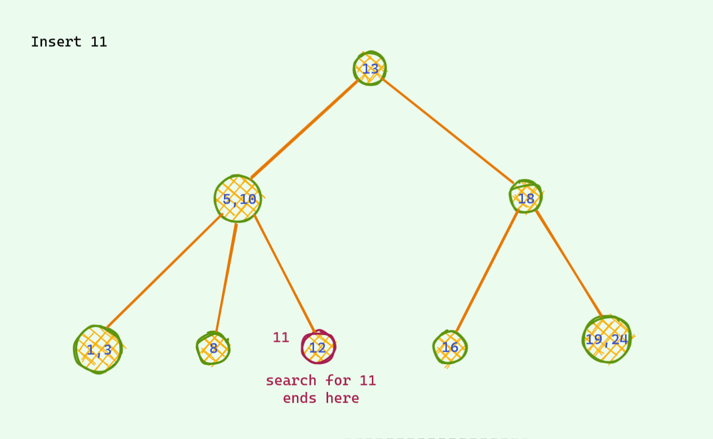
    
    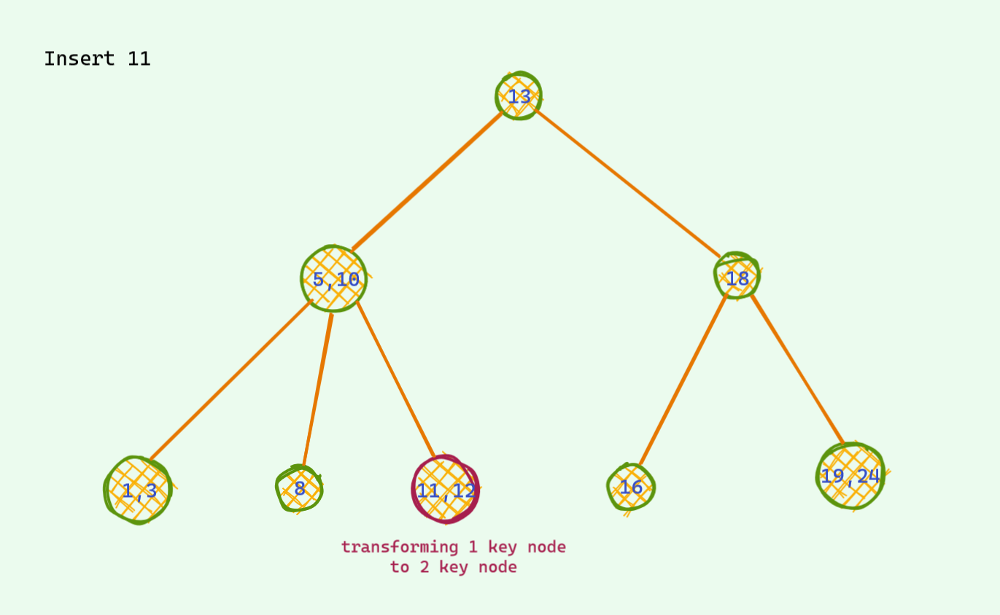
&nbsp;

- **When does problem arise ?**  
The problematic case : we find the corresponding place for insertion and we insert it . If after insertion we see there are 3 keys , we are in troubble : ( As mentioned earlier , there can be atmost 2 keys per node . So , we need to somehow fix this unstable node . Otherwise we are doomed . Here is an example .

    

    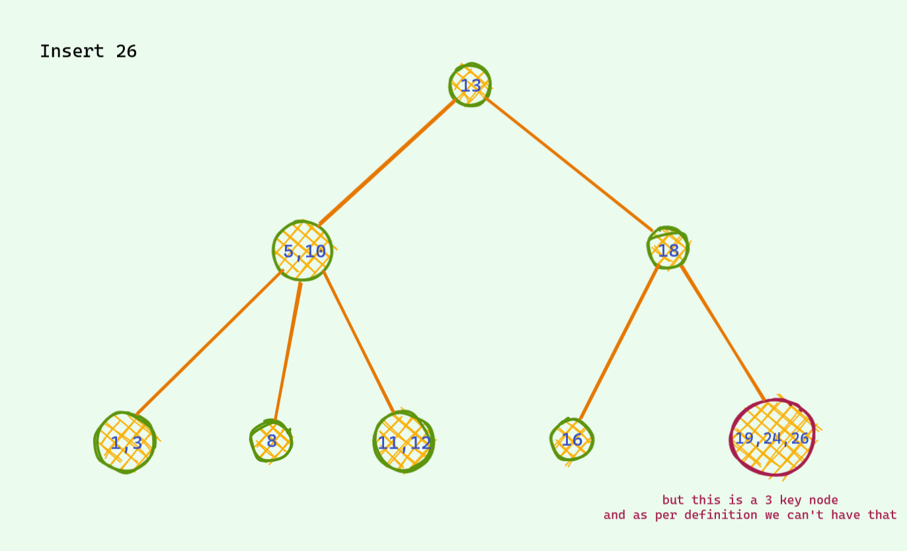
Now that we are stuck , it's not hard no find a way around in this tree . We see that `18` is sitting lonely out there and has a place for one extra friend . We push up the middle key of the unstable node and voila we are good again . There are no more 3 key node in this tree . 

    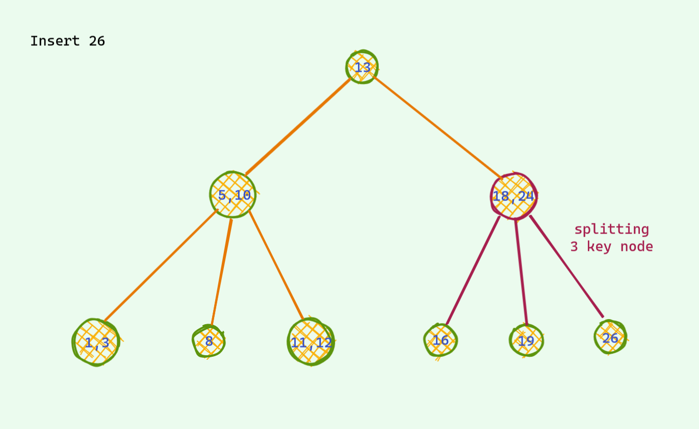
Nice save : D   

Now if you have _good observation_ , you might have observed that _all the leaf nodes have same distance from the root_ . This is not just a conincedence . Let's see why this is the case .   
&nbsp;
 We have seen 2 different type of insertions so far and if you noticed , none of them changed the height of the tree . Now let's consider a case where the push up is such that there is an increase of height . 

 
 
 
 

 Did you see what just happened ? The height of the tree increased by 1 and the distance of all the leaf nodes increased exactly by 1 . Thus leading to having all the leaf nodes in the same height/depth .

 ### **Key Takeaway from slightly modified BST**
 We saw earlier that if there was a way to balance our BST , we can efficiently do operations . Our slightly modified BST does exactly that ! We just saw that our tree is always perfectly balanced !
 In this slightly modified BST , 
 - **Worst Case Height** : **`O(log_base2_N)`** / **`O(logN)`** (All nodes have 2 keys)
 - **Best Case Height** : **`O(log_base3_N)`** (All nodes have 3 keys)
  
## **Modifying one step further**

This time we will allow upto 3 keys per node . One more than the last time . This time there is also one problematic case : when we  have 4 keys per node . We also do almost the same thing we did the last time . When there is a potential 4 key node , we split to make room for the new key .

I will just show an example and won't dive deep .

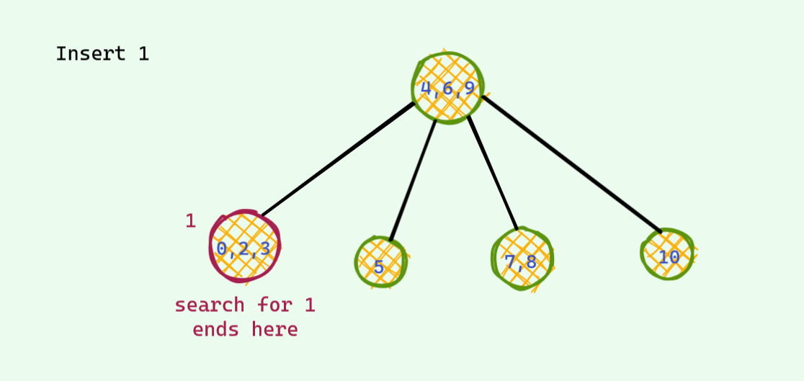


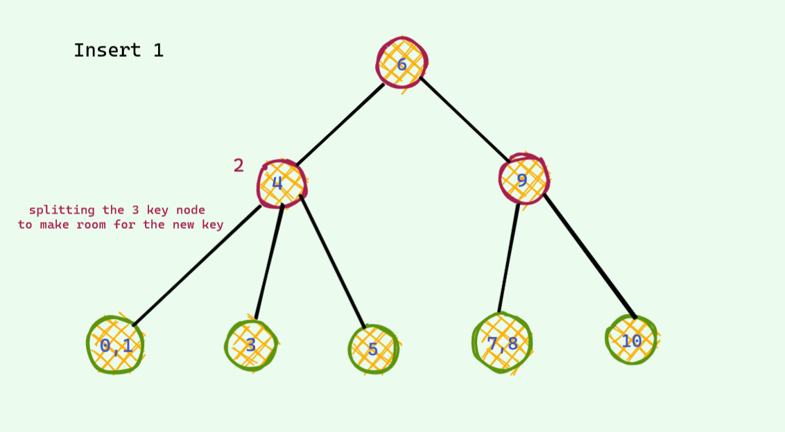


&nbsp;

# **Changing Vantage Point**
Simulating this tree seems to be very easy in hand . But coding up this is not . Maintaing varaible number of keys in a node and also handling tree spliting can be a cumbersome job to do . If you are a lazy guy like me you wouldn't dare to implement this .

&nbsp;
Now , let's change our vantage point . Let's cleverly represent this nodes so that we don't have to deal with all these tree spliting and variable nodes .

&nbsp;
With a bit of imagination , we can think the 2 key nodes as 2 seperate nodes glued together by an edge . If we draw this link by leaning on the side a bit , you can see that it is just your familiar BST .

&nbsp;
But wait ! How do you distinguish between an **ordinary edge** and a **glue edge** . Yes ! we color it : D 

Here's how we can represnt the **`2 key nodes`** :

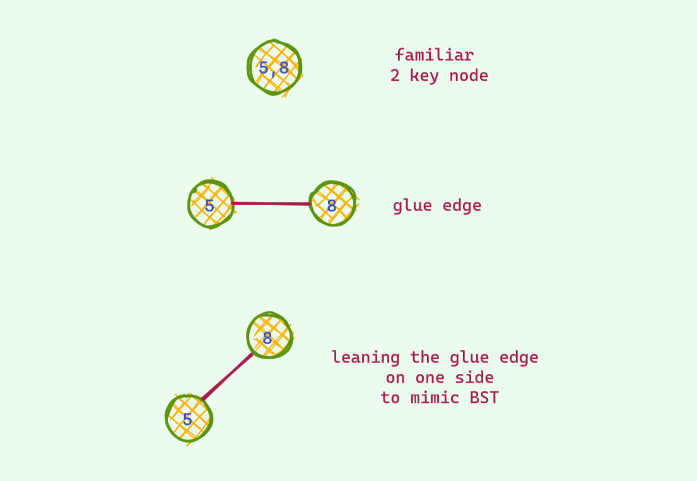

And here's how we can represent the **`3 key nodes`** :

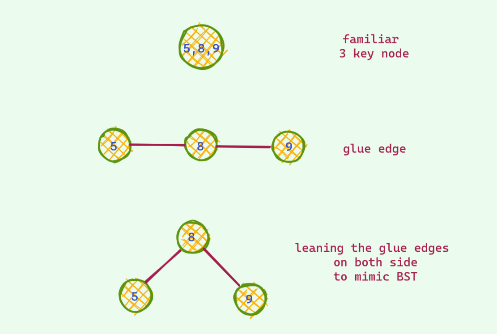

We can also instead color children nodes thus making it conveninent to implement as tracking edge colors in BST implementation would not be a headache anymore .

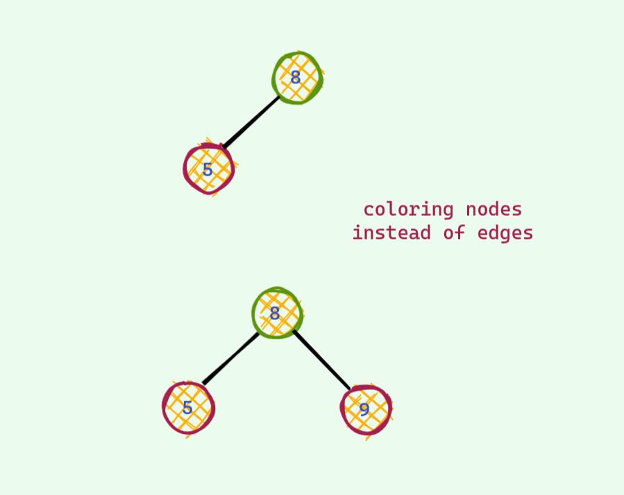 

This was the eureka moment for me ! This is the **Red Black Tree** we have studied blindly all this time ! Finally we figured out the **coloring** ! RBT is nothing but a fancy way of representing the slightly modified BST we saw earlier . Isn't this great ? : D 


Now you ask , why is this red ? Why not any other colors ?
<details>
<summary>
Answer
</summary>

It was because the guys who invented this , only had red and black pens to draw :v And they chose to color the nodes red .
</details>

&nbsp;

# **Inside the Black Box**

## **Insert**

Now , we know that the operations we saw till now was RBT under the hood . Let's see how these operations look in the RBT .

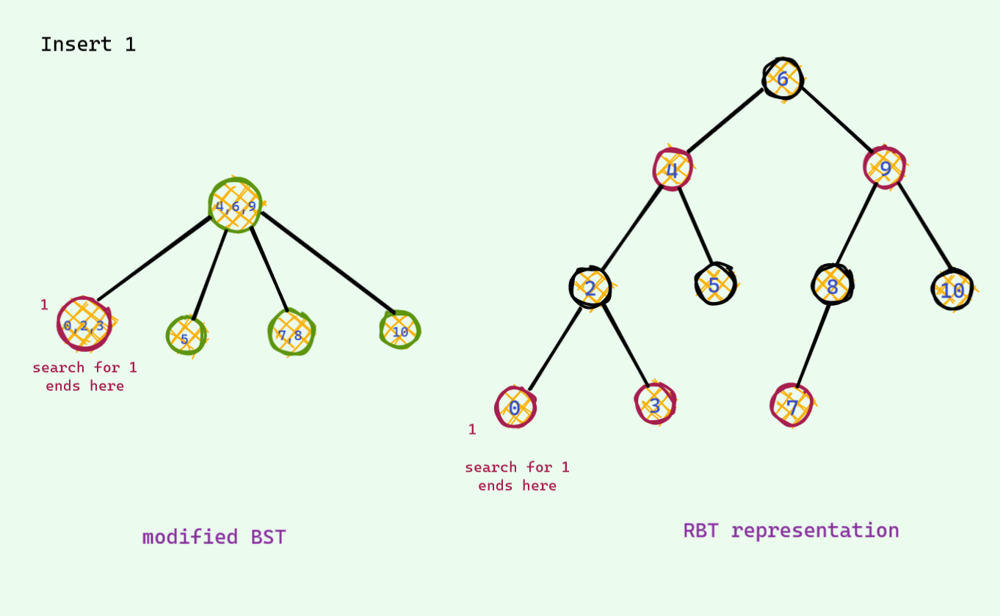


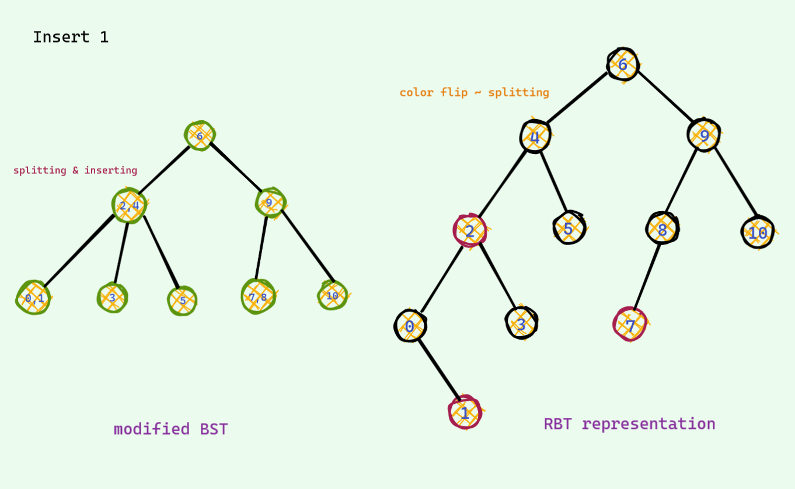

If you open a random book , you must have seen this weird rule which goes something like this : when there are 2 red nodes in a row and uncle is also a red node , we do color flip . Now you see what those color flip actually do ! These is just a fancy way to implement the splitting on the modified BST .

Now , let's see another type of insertion .


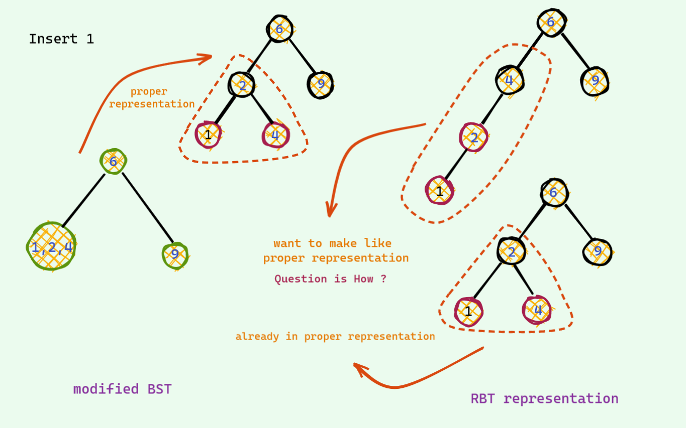

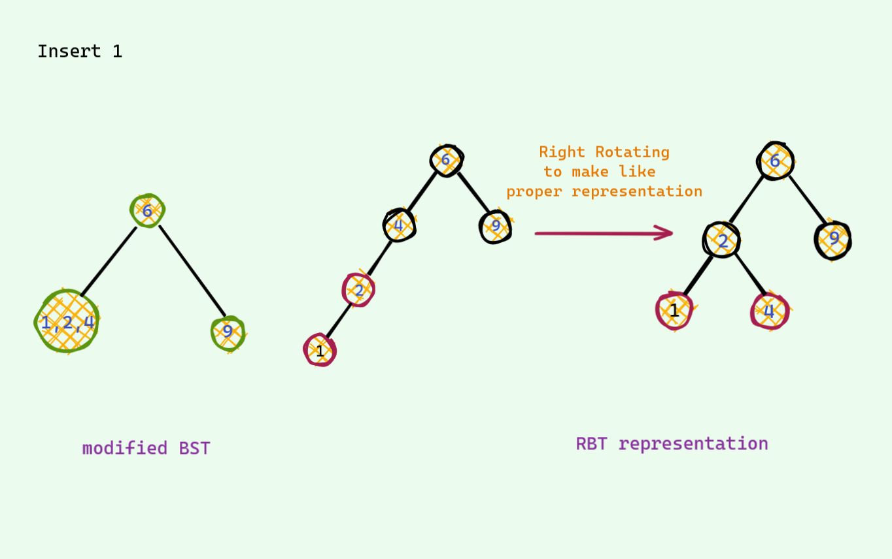

You might have also seen a rule which goes something like this : when there are 2 red nodes in a row and uncle is a black node , we need to rotate to balance the RBT . This is just a normal insertion in the modified BST ! This one has 2 case : the node could be red nodes could be in Left Right order unlike the Left left order shown in the last example . This is the same , just we do 2 rotations to come to our proper 3 key node representation .


## **Delete**

Insertion was pretty easy . Most of the books represent delete in RBT as an awful hard operation . Infact when I first read the deletion , it was just a bunch of messy casework to memorize and I had no idea what the heck we were actually doing . But now , it has changed . Deletion is not difficult than insertion in any way , if not easier !

&nbsp;
But , first let's recap some RBT properties which can be easily seen from our modified BST analagoy :
- In modified BST , all leaf nodes were at the same height . So , in our RBT all the subtrees will have same black height (remember how red nodes doesn't contribute to the height , we just lean on either side to mimic BST)
- Root is always black 

This 2 properties are enough to understand Deleteion .

Deletion process is almost similar to the normal BST . I won't dive deep . Here is a recap :
- If we have less than 2 child , we can delete this node
- Otherwise , we replace with the successor / predecessor node and delete that node instead
  
Now in case of RBT , there can be some violation . Let's see :
- If we are deleting a red node , we are safe (Remember that we can easily delete from 2 key node in our slightly modified BST as it doesn't affect the height of the tree)
- But if we are deleting a black node , we are in trouble : (  Deleting a black node will violate the first property we have seen earlier . We gotta fix this . This is the whole fiasco is about .

Let's begin . Rather than telling you a bunch of awful rules to memorize , let us see what can and can't be done intuitively . Let me walk you thorugh -

**The Easy One**  

This time , the node we deleted has black sibling and no red children . Let see how it goes if we want to restore balance -

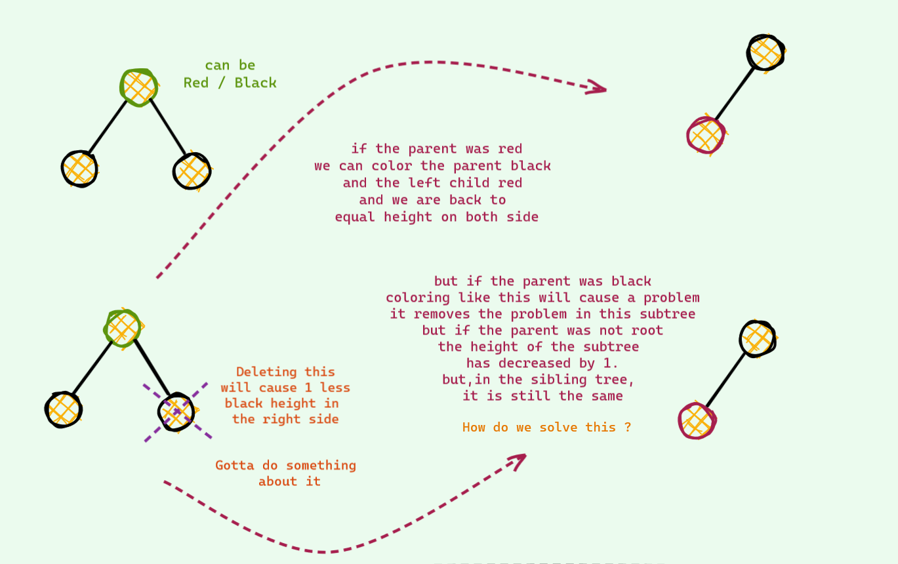

The idea to solve this is we hand our problem to the parent . And if the parent couldn't solve , then we repeat the same process . We know that it will be fixed some time in the future because we just saw in the case of parent being the root , our problem is solved immediately . 


**The Easier One**  
This time , the node we deleted has black sibling and at least one red children . Let's see how this one goes -


Pretty easy !

There is just one corner case , if the only red child was the right node in the example we just saw , we would have to do one more rotation (like we did in the insert) to make it like the one we solved .

**The Clever One**

We are almost done . We just need to take care of one last thing . The red sibling case - 


And now , we are done . See ! It was not that bad . Once we know why we are doing what , it immensly simplifies stuffs !

# **Getting our hands dirty (with code)**

All these efforts till now were all for this . We had to come up with glue nodes and what not just so that we can easily implement this thing . So , let's get into it !

I remmber when i first the RBT pseudocode from Cormen (CLRS) , I had a mini heart attack . My first reaction was , " Eww, how can a code be this ugly ! " And the impression hasn't changed a bit . It is still one of the most ugliest implementation I've seen till date . Coding a red black tree doesn't have to be this ugly .

Instead , I will guide you with a recursive implementation which I found much easier to code . Much much easier to debug and the size of the code will be half the size of the cormen implementation if not less . 

## **The Node**

We need just one more information from our usual BST : Color . No need to track parent or any other things . And about why we have taken a pointer array , not 2 left right pointers , I will get to that in a second .

```c++

#define left 0
#define right 1

struct Node
{
    int data,color;
    Node *child[2];

    Node(int data,int color)
    {
        this->data = data;
        this->color = color;
        this->child[left] = NULL;
        this->child[right] = NULL;
    }
};
```

## **Auxilary Operations**

The main auxilary operations are **`rotation`** and **`color flipping`** . The implementations are pretty much straightforward . If we had taken 2 seperate pointers , the implementation would be like this 

```c++
void colorFlip(Node *node)
{
    node->color = node->color^1;
    node->left->color = node->left->color^1;
    node->right->color = node->right->color^1;
}

Node* leftRotate(Node *node)
{
    Node *temp = node->right;
    node->right = temp->left;
    temp->left = node;

    temp->color = node->color;
    node->color = RED;

    return temp;
}

Node* rightRotate(Node *node)
{
    Node *temp = node->left;
    node->left = temp->right;
    temp->right = node;

    temp->color = node->color;
    node->color = RED;

    return temp;
}
```

But , if instead we had implemented using pointer array , we can actually write only one function for the rotation ! 

```c++
Node* rotate(Node *node,bool dir) /// direction : left / right
{
    Node *temp = node->child[!dir];
    node->child[!dir] = temp->child[dir];
    temp->child[dir] = node;

    temp->color = node->color;
    node->color = RED;

    return temp;
}
```

And this way , our double rotation code is just 2 lines !

```c++
Node* doubleRotate(Node *node,bool dir) /// align reds  , then rotate
{
    node->child[!dir] = rotate(node->child[!dir],!dir);
    return rotate(node,dir);
}
```

We have already made our code half the size ! You will be amazed to see the magic of this further when we don't have to seperately handle the mirror cases in insert and delete operation : D At least I was when I found out this trick in a blog which dramatically reduced my original insert implementation .

Let's get into insertion .

## **Insert**

```c++
void insert(int data)
{
    root = __insert(root,data);
    root->color = BLACK;
}

Node* __insert(Node *node,int data)
{
    if(node == NULL)
        return new Node(data,RED);

    bool dir = data > node->data; /// left -> 0 , right -> 1

    node->child[dir] = __insert(node->child[dir],data);

    return INSERT_FIX_UP(node,dir);
}
```

We just need to write this magic function **`INSERT_FIX_UP`** and we are done ! Iterative implementations needs to track parent and also handing all the cases can be really pain . But , we will take advantage of the bottom up approach . If a RBT property violation has occured , we will fix on our way up in the recursion !

```c++
Node* INSERT_FIX_UP(Node *node,bool dir)
{
    if(red(node->child[dir]))
    {
        /// case 1 : both child red => any one child has 2 reds in a row (LL LR RR RL) => flip colors
        if(red(node->child[!dir]))
        {
            if(red(node->child[dir]->child[dir]) || red(node->child[dir]->child[!dir]))
            {
                colorFlip(node);
            }
        }
        else
        {
            /// case 2 : both child not red
            if(red(node->child[dir]->child[dir]))
            {
                /// any one child has 2 reds in a row (LL RR) => rotate
                node = rotate(node,!dir);
            }
            else if(red(node->child[dir]->child[!dir]))
            {
                /// any one child has 2 reds in a row (LR RL) => align first , then rotate
                node = doubleRotate(node,!dir);
            }
        }
    }
    return node;
}
```

See , how we don't need to write code for additional **mirror cases** !

## **Delete**

The delete skeleton is the same as regular BST , with just one minor change . We keep a **`flag`** variable to keep track if we have already restored the balance or not . 

```c++
void delete_(int data)
{
    bool ok = false;
    root = __delete(root,data,ok);
    if(root!=NULL) root->color = BLACK;
}

Node* __delete(Node *node,int data,bool &ok)
{
    if(node == NULL)
    {
        ok = true;
        return;
    }

    /// found the delete key
    if(node->data == data)
    {
        /// has one or less child
        if(node->child[left]==NULL || node->child[right]==NULL)
        {
            Node* temp = NULL;
            if(node->child[left]) temp = node->child[left];
            if(node->child[right]) temp = node->child[right];

            if(red(node)) /// the node is red => just delete it
            {
                free(node);
                ok = true;
            }
            else if(red(temp)) /// only child is red => replace with that red child and recolor black . so , black balance restored
            {
                temp->color = BLACK;
                free(node);
                ok = true;
            }

            return temp;
        }
        else /// has 2 child => replace with inorder predecessor / successor and recurse for that
        {
            Node *temp = getMax(node->child[left]); /// inorder predecessor : maximum value in the left subtree

            node->data = temp->data;
            data = temp->data; /// updating with predecessor data as this is the one to delete now
        }
    }


    bool dir = data > node->data;

    node->child[dir] = __delete(node->child[dir],data,ok); /// recurse
    
    return ok ? node : DELETE_FIX_UP(node,dir,ok);
}
```

Now , we have to write the magic function **`DELETE_FIX_UP`** .

```c++
Node* DELETE_FIX_UP(Node *node,bool dir, bool &ok)
{
    Node *parent = node; /// saving for later red sibling fixing case
    Node *sibling = node->child[!dir];

    /// Red Sibling Case => Reduce to Black Sibling Case
    if(red(sibling))
    {
        node = rotate(node,dir);
        sibling = parent->child[!dir];
    }

    if(sibling != NULL)
    {
        /// Black Sibling Case , Part 1 : Black Sibling with only black children
        if(!red(sibling->child[left]) && !red(sibling->child[right]))
        {
            if(red(parent)) ok = true; /// will color it black and sibling subtree will not have imbalance

            parent->color = BLACK; /// if not ok , we proceed further
            sibling->color = RED;
        }
        else /// Black Sibling Case , Part 2 : Black Sibling with not red children
        {

            int initcol_parent = parent->color;
            bool isRedSiblingReduction = !(node==parent);

            if(red(sibling->child[!dir])) /// RR , LL
            {
                parent = rotate(parent,dir); /// single rotation
            }
            else
            {
                parent = doubleRotate(parent,dir); /// align and rotate
            }

            parent->color = initcol_parent; /// color will be the same as initial parent
            parent->child[left]->color = BLACK;
            parent->child[right]->color = BLACK;

            if(isRedSiblingReduction)
            {
                node->child[dir] = parent; /// fixing the child for proper bottom up fixing later
            }
            else
            {
                node = parent; /// usual black case
            }

            ok = true;
        }
    }

    return node;
}

```

Ah , we are done finally ! It was not that awful , was it ?

# **Optimization and Conclusion**

If you have come this far down , let me tell you one more thing . The RBT we studied is the classical old RBT . There are other implementations of RBT which makes the code even more shorter and easier to write . Among these , one is Left Leaning Red Black Tree (LLRB) . It is nothing but the implementation of the first modified BST we saw . And about the implementation , we can also use a topdown approach , that is also easier to understand tahn the bottom up approach . If you do feel interested , check them out .

Thanks for reading this far : D If you still have any problem , do let me know . And if you liked the writeup do let me know too !

# **Reference**
- [https://en.wikipedia.org/wiki/Red%E2%80%93black_tree?oldformat=true](https://en.wikipedia.org/wiki/Red%E2%80%93black_tree?oldformat=true)
- [https://www.cs.purdue.edu/homes/ayg/CS251/slides/chap13c.pdf](https://www.cs.purdue.edu/homes/ayg/CS251/slides/chap13c.pdf)
- [http://smile.ee.ncku.edu.tw/old/Links/MTable/Course/DataStructure/2-3,2-3-4&red-blackTree_952.pdf](http://smile.ee.ncku.edu.tw/old/Links/MTable/Course/DataStructure/2-3,2-3-4&red-blackTree_952.pdf)
- [https://stackoverflow.com/questions/15455042/can-anyone-explain-the-deletion-of-left-lean-red-black-tree-clearly](https://stackoverflow.com/questions/15455042/can-anyone-explain-the-deletion-of-left-lean-red-black-tree-clearly)
- [https://www.cs.princeton.edu/~rs/talks/LLRB/LLRB.pdf](https://www.cs.princeton.edu/~rs/talks/LLRB/LLRB.pdf)
- [https://stackoverflow.com/questions/364616/in-red-black-trees-is-top-down-deletion-faster-and-more-space-efficient-than-bot/8024168#8024168](https://stackoverflow.com/questions/364616/in-red-black-trees-is-top-down-deletion-faster-and-more-space-efficient-than-bot/8024168#8024168)
- [https://www.youtube.com/watch?v=DQdMYevEyE4](https://www.youtube.com/watch?v=DQdMYevEyE4)
- [https://eternallyconfuzzled.com/red-black-trees-c-the-most-common-balanced-binary-search-tree](https://eternallyconfuzzled.com/red-black-trees-c-the-most-common-balanced-binary-search-tree)
- [https://stackoverflow.com/questions/14119995/red-black-tree-top-down-deletion-algorithm?rq=1](https://stackoverflow.com/questions/14119995/red-black-tree-top-down-deletion-algorithm?rq=1)
- [https://stackoverflow.com/questions/13360369/deletion-in-left-leaning-red-black-trees](https://stackoverflow.com/questions/13360369/deletion-in-left-leaning-red-black-trees)
- [ftp://ftp.cs.princeton.edu/techreports/1985/006.pdf](ftp://ftp.cs.princeton.edu/techreports/1985/006.pdf)
- [https://sites.cs.ucsb.edu/~teo/cs130a.m15/rbd.pdf](https://sites.cs.ucsb.edu/~teo/cs130a.m15/rbd.pdf)
- [https://stackoverflow.com/questions/14119995/red-black-tree-top-down-deletion-algorithm](https://stackoverflow.com/questions/14119995/red-black-tree-top-down-deletion-algorithm)
- [https://iq.opengenus.org/red-black-tree-deletion/](https://iq.opengenus.org/red-black-tree-deletion/)
- [https://github.com/jeffrey-xiao/competitive-programming/blob/master/src/codebook/datastructures/RedBlackTree.java](https://github.com/jeffrey-xiao/competitive-programming/blob/master/src/codebook/datastructures/RedBlackTree.java)
- [https://www.topcoder.com/community/competitive-programming/tutorials/an-introduction-to-binary-search-and-red-black-trees/](https://www.topcoder.com/community/competitive-programming/tutorials/an-introduction-to-binary-search-and-red-black-trees/)
- [https://softwareengineering.stackexchange.com/questions/141834/how-is-a-java-reference-different-from-a-c-pointer](https://softwareengineering.stackexchange.com/questions/141834/how-is-a-java-reference-different-from-a-c-pointer)
- [https://www.programiz.com/dsa/red-black-tree](https://www.programiz.com/dsa/red-black-tree)
- [https://www.cs.usfca.edu/~galles/visualization/RedBlack.html](https://www.cs.usfca.edu/~galles/visualization/RedBlack.html)
- [https://www.cs.princeton.edu/courses/archive/fall06/cos226/lectures/balanced.pdf](https://www.cs.princeton.edu/courses/archive/fall06/cos226/lectures/balanced.pdf)
- [https://www.cs.princeton.edu/courses/archive/spring19/cos226/lectures/33BalancedSearchTrees.pdf](https://www.cs.princeton.edu/courses/archive/spring19/cos226/lectures/33BalancedSearchTrees.pdf)


